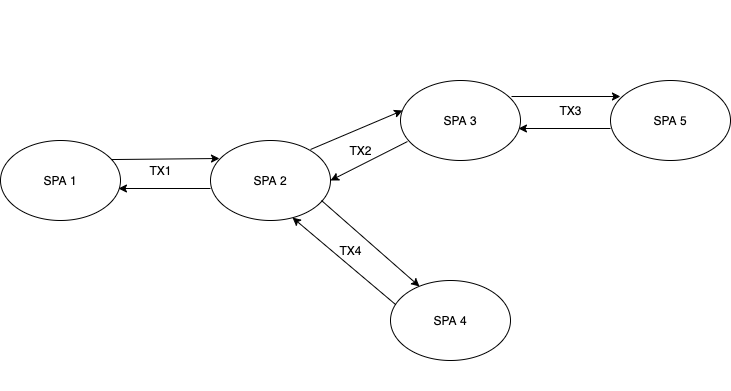

# ICIMS SPA Navigation Framework

Utility framework supporting functional reuse of SPAs via navigation. In the following descriptions a `calling` SPA is one that invokes functionality from a `target` SPA. All framework functionality is provided by a lightweight API, and both SPAs must cooperate using the framework. A `calling` SPA uses regular URLs and query parameters to invoke the `target` SPA and the framework automatically adds its own reserved URL parameters to keep track of the flow and data passed outside of URL parameters. 

Both `calling` and `target` SPAs calling need to call an `initialize` framework method which checks for any existing saved state, valid call flows, etc. Then the `calling` SPA creating a `request` (a connection to a `target` SPA) over which data can be passed and returned. The framework uses `transactions` to keep track of requests. A single SPA can invoke more than one SPA, and the called SPA can transparently invoke other SPAS. The most general structure looks like this:



Here, SPA1 invokes SPA2 and waits for it to return. SPA2 invokes both SPA3 and SPA4 before returning and SPA3 transparently invokes SPA5. 

Three specific modes are supported:

* *Navigation*. The `calling` SPA uses the transaction to navigate to the `target` SPA which completes its job and redirects back when finished. The `calling` SPA may optionally pass data to the `target` SPA and also save state that can be restored upon return. The `calling` SPA provides a `backUrl` (defaulting to `window.location` at the time of the call). In this mode the `target` SPA is responsible for documenting the URLs that may be invoked, what data it accepts, and what data it may return. The `target` SPA must use this framework to check for requests in this mode and may optionally pass return data back when its function is complete.

* *Closable iframe*. The `calling` SPA opens the `target` SPA in a closable iframe. This is very similar to the first mode and a single `target` SPA can work with either mode in exactly the same way. Optional data can only be returned once when the `target` SPA is complete, then the iframe is closed. 

* *Permanent iframe*. The `calling` SPA opens the `target` SPA in a frame which may remain open. The `target` SPA can provide data back to the `calling` SPA at any time, not just before the frame is closed. This mode uses a slightly different API and may not be supported by all `target` SPAs. 

In addition to passing and returning data the first mode also allows the `calling` SPA to save arbitrary `state` that will be returned to it upon back navigation.

## Exposed Routes

Any SPA offering reusable functionality needs to document the exported URLs, URL parameters and optional input data and return values. The context will likely be different from arriving at that SPA via top level navigation, for example only rendering certain views, not showing the top level navigation menu, etc., which should also be documented.

For example. assume the Profile SPA uses redux-router to render views for managing user profiles, including:

```
/profile/search     - search profiles, display result lists with click to edit or view buttons
/profile/:id/view   - view a profile
/profile/:id/edit   - edit an existing profile
/profile/:id/new    - create a new profile
```

To allow other SPAs to reuse some specific functionality, it provides and documents usage for these routes:

```
/profile/export/search     - search profiles, display result lists with click to edit or view buttons
/profile/export/:id/view   - view a single profile
/profile/export/:id/edit   - edit a single profile
/profile/export/browse     - Similar to view, but also accepts an ordered list of IDs, a `startIndex`, and displays next/previous buttons. Returns the `endIndex`.
```

Exported routes may mirror regular routes available via top level navigation, but *should always use URLs that explicitly mark them as being exported*. Internally they can render the same views as the "local" versions, or they can add or omit certain components where there are differences between the two modes. 

Note that in this example the `/profile/export/browse` route is NOT used locally by the SPA but allows the calling SPA to reuse the `view` profile function by passing ordered list of IDs and `startIndex` (default = 0) and adding next/previous buttons. When it redirects back to the calling SPA it returns the index of the last viewed profile as `lastIndex`. 

## Framework Initialization

You need to initialize the framewrk at SPA startup before any URL change takes place. This allows the framework to check for any inbound or outbound framework parameters and to read any saved state from `sessionStorage`. For option flags, you can optionally pass a boolean value for `enableLogging` set to `true` to enable framework console logging. You'll probably want to do this in local development mode. This example uses a `REACT_APP` environment variable:

```js
import { initialize } from '@icims/spafx';

// Assume SPA uses a variable to enable framework tracing
if (process.env.REACT_APP_ENABLE_SPA_FX_LOGGING) {
  initialize({enableLogging: true});
}
else {
  initialize();
}
```

## Calling Another SPA

When calling another SPA, the following optional and required parameters are:

* url       - The URL of the SPA. Required.
* backUrl   - The return URL. Optional (default = current browser URL)
* qparams   - Object containing query parameters. Optional (default = {})
* data      - Object containing data to pass in addition to query params. Optional. (default = null. Max size of data = 6 mb)
* state     - Any state to be saved in between invocations. This will be available in the response object under the `state` key.

To call another SPA use the `createRequest` method. This returns a request object that you can use this to create navigation links in advance using the `link` method (to add to link tags, for example), or you invoke the `navigate` method to pass in query parameters and data and perform the redirection. 

**NOTE**: If you need to pass data or state outside of query parameters, you cannot generate links in advance and must use the `navigate` method. Passing data in this way uses session storage that needs to be cleared after navigation. 

### Examples

```js
import { initialize, createRequest } from '@icims/spafx';

// Assume SPA uses a variable to enable framework tracing
if (process.env.REACT_APP_ENABLE_SPA_FX_LOGGING) {
  initialize(true);
}
else {
  initialize();
}

// examples that create links in advance

let link;
// create a link that will redirect back to the current URL
link = createRequest(targetSpaUrl).link();

// create a link that will redirect back another page
link = createRequest(targetSpaUrl, someLocalUrl).link();

// create a link that has some query params
const params = {id: 1234}
const targetSpaUrl = '/spa2';
link = createRequest(targetSpaUrl).link(params); // "/spa2?id=1234"

// examples that navigate, using query parameters and optional data
const data = getSomeData(); 

createRequest(targetSpaUrl).navigate(); // redirect
createRequest(targetSpaUrl).navigate(params); // redirect with query params
createRequest(targetSpaUrl).navigate(params, data, state); // redirect with params, data, and state
createRequest(targetSpaUrl).navigate(null, data); // redirect with just data
createRequest(targetSpaUrl).navigate(null, data, state); // redirect with data and state
createRequest(targetSpaUrl).navigate(null, null, state); // redirect with just state

```

The `data` property will be passed to the target SPA in the inbound request object. The `state` property will be available in to the invoking SPA in the response object (see below).

## Checking for Responses

If you need to process a response from another SPA, you can use the `getResponse` method to check if a response was received. This will return `null` if no requests were made, otherswise it be an object, possibly empty. If `response.error` is set, it means the call failed and the caller can check `response.error.code` and `response.error.message`. Any other keys in the response object are return values from the called SPA, and `response.data` may also contain larger response data. If you provided any state in the outbound request it will be available as `response.state`. 

```js
import { getResponse } from '@icims/spafx';

// during SPA initialization

const response = getResponse();

if (response) {
  // returning from a request
  if (response.error) {
    // check and possibly display an error condition
  }  
  // process any response values or response.data
} 
```

## Checking for inbound Requests

If a SPA exposes any reusable views it should check for requests during initialization using the `getResponse` method. A non-`null` return indicates an inbound request. The returned object will have a `returnUrl` property with the URL to redirect back, and otionally a `data` property if the calling SPA passed any data. 

```js
import { getRequest } from '@icims/spafx';

// during initialization

const request = getRequest();
if (request) {
  // inbound request from another SPA, access request.backUrl and optionally request.data 
}
```

## Redirecting back to the calling SPA

The request object returned by `getRequest` has methods `link` and `navigate` for navigating back to the calling SPA, similar to `createRequest`. If returning values that can be handled by URL parameters either method can be used. If passing larger data back then the navigate method must be used:

```js
import { createResponse } from '@icims/spafx';

let link;

// create a back link for the Close or Back button
link = request.createResponse().link();

// create a link and return values via URL params
const params = {message: 'hello'};
link = request.createResponse(params).link();

// return using navigate, with optional data
const data = getSomeData(); 

request.createResponse().navigate(); // redirect back
request.createResponse().navigate(params); // redirect with query params
request.createResponse().navigate(params, data); // redirect with params and data
request.createResponse().navigate(null, data); // redirect with just data
```

## Redirecting back with errors

If there are errors with the request, the invoked SPA can use the `createErrorResponse` method of the `request` object. Similar to `createResponse`, the returned object has `link` and `navigate` methods. The `link` method might be used to display a message to the user with a Back button. A return code is required, and a message is optional:

```js
const backLink = request.createErrorResponse(403).link();

request.createErrorResponse(400, 'unrecognized parameter').navigate();
```


## Framework URL parameters and sessionStorage

The framework uses URL parameters for passing data between SPAs, outside of any URL parameters normally used by the calling and called SPAs. These values will be prefixed by `fw_` which is a reserved prefix. 

For inbound requests the `backUrl` will often be the only parameter identifying this as a request:

```js
// Assume the current browser URL is /recruit/candidate/1234 and the
// recruit SPA invokes the profile SPA to display a basic user profile

const link = createRequest('/profile/basic/view/1234').link();

// link = /profile/basic/view/1234?fw_back=/recruit/candidate/1234 
```

Likewise, when an invoked SPA redirects back with response parameters, a return link will have `fw_` prefixed parameters carrying the response parameters. 

Any data that can't be passed via the URL will use `sessionStorage`, but this is an implementation detail of the framework. Request data will be stored under a key that identifies the SPA. For example:

```js
// recruit SPA calling the profile SPA with data

createRequest(targetSpaUrl).navigate(null, data); // redirect with just data

// at this point, sessionStorage will have a key indicating request input data 
// for the profile SPA, like:

// profile.request = data
```

After the profile SPA calls `getRequest`, the sessionStorage key will be cleared. Likewise, if the profile SPA redirects back to the recruit SPA with response data, a sessionStorage key will be created:

```
recruit.response = { response data }
```
And this key will be cleared when the recruit SPA calls `getResponse`.
